#  Partie 1 – API REST Spring Boot 4 (Gestion des étudiants)

## 📌 Description

Cette API REST développée avec **Spring Boot 4** permet de gérer une liste d'étudiants.
Elle expose un endpoint permettant de récupérer les étudiants depuis une base de données **PostgreSQL** exécutée via Docker.

---

## 🛠️ Technologies utilisées

* Java 17+
* Spring Boot 4
* Spring Web
* Spring Data JPA
* PostgreSQL (via Docker)
* Lombok (optionnel)
* Maven

---

## 🚀 Endpoint disponible

| Méthode | URL              | Description                     |
| ------- | ---------------- | ------------------------------- |
| GET     | `/api/etudiants` | Retourne la liste des étudiants |

---

## 🧾 Attributs d'un étudiant

* `id` : Long (auto-généré)
* `cin` : String
* `nom` : String
* `dateNaissance` : LocalDate

---

## 🐳 Lancer l'API avec Docker (PostgreSQL + Spring Boot)

Assurez-vous que Docker est installé et en cours d'exécution, puis lancez :

```bash id="sqqxrh"
docker compose up --build
```

👉 L'application sera accessible sur :
http://localhost:8080

---

## 📸 Screenshots (Partie 1)

### 1️⃣ Structure du projet

Cette capture montre l'organisation des dossiers du projet Spring Boot :

* `api-spring-boot/` : dossier principal de l'API
* `src/main/java/` : code source Java (controllers, entities, repositories)
* `src/main/resources/` : fichiers de configuration
* `pom.xml` : dépendances Maven


---

### 2️⃣ Liste des étudiants (GET /api/etudiants)

Cette capture présente le résultat de l'appel API `GET /api/etudiants` avec la liste complète des étudiants.

Pour chaque étudiant :

* CIN
* Nom
* Date de naissance


---

### 3️⃣ Exécution de l'API

Cette capture montre le bon fonctionnement de l'application :

* Console de lancement (logs Spring Boot)
* API accessible sur `http://localhost:8080`
* Chargement des données initiales


---

## ✅ Résultat

L'API fonctionne correctement et permet de récupérer les données des étudiants depuis PostgreSQL via un endpoint REST simple.

# Partie 2 – Enrichissement de l'API Spring Boot

## Objectif

Cette partie enrichit le projet de la Partie 1 en ajoutant :

- Une méthode de calcul d'âge (`age()`)
- Des tests BDD avec Cucumber
- Une interface web statique (`index.html`)
- Une image Docker publiée sur Docker Hub
- Un déploiement Kubernetes (K3s)
- Une entité `Departement` avec relation `@ManyToOne`
- Une architecture en couches (DTO, Mapper, Service, Controller)
- Des opérations CRUD complètes
- Une gestion des erreurs HTTP standard
- Un cache Redis
- Un projet Jira Scrum

---

## Q3 – Tests BDD avec Cucumber

Exécution des tests Cucumber validant la méthode `age()`.


---

## Q4 – Page `index.html` avec Fetch JavaScript

Page statique consommant l'API et affichant les étudiants.

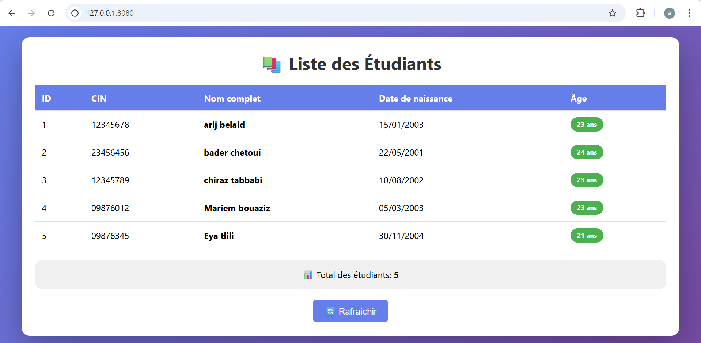

---

## Q6 – Déploiement sur Kubernetes (K3s)

Vérification des pods et services sur le cluster K3s.

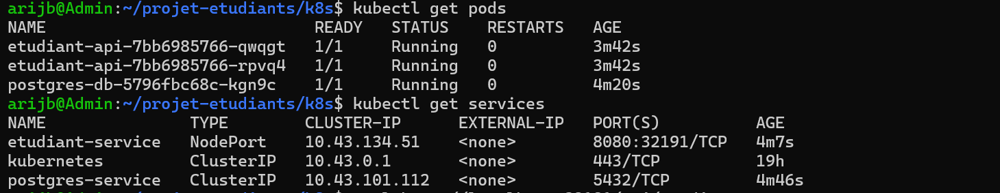

---

## Q7 – Entité Département

Endpoint `GET /api/departements` retournant les 3 départements.

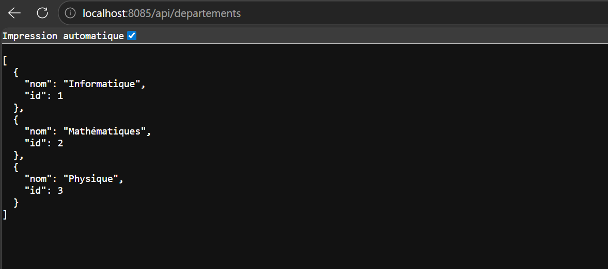

---

## Q9 – Requête personnalisée

Recherche des étudiants par année d'inscription.

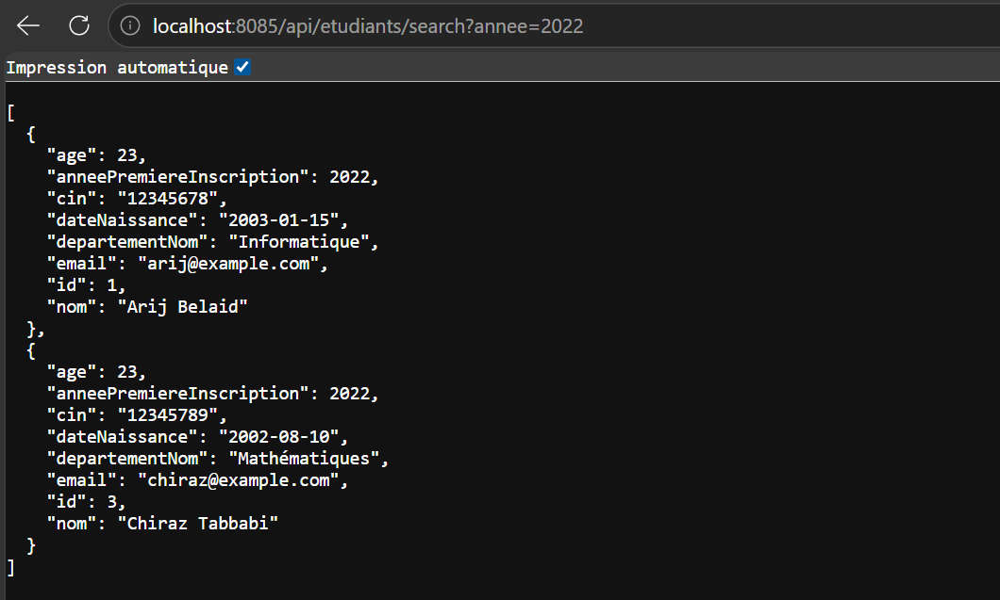

---

## Q10 – CRUD complet

### Création d'un département

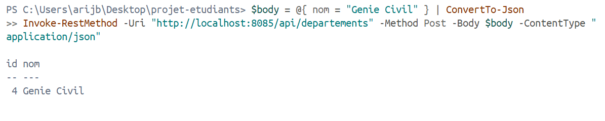

### Création d'un étudiant

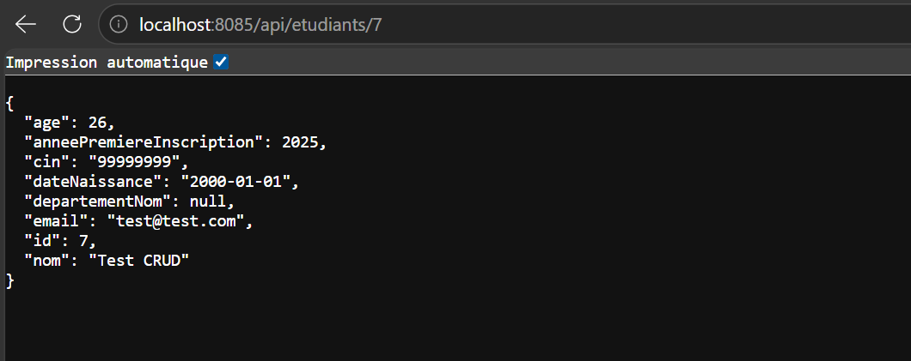

### Modification d'un étudiant

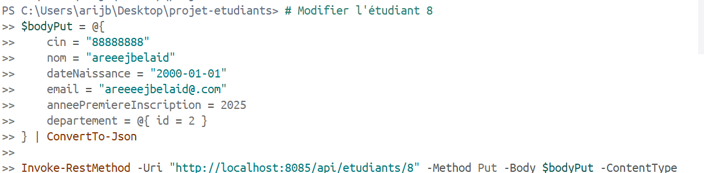

### Suppression d'un étudiant

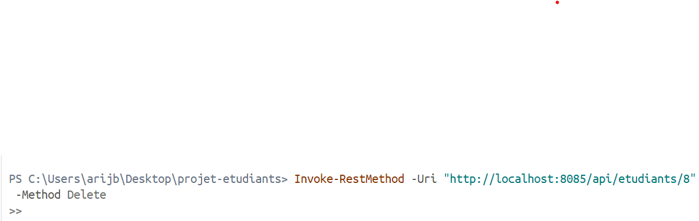

---

## Q11 – Gestion des erreurs

Erreur 404 retournée pour un étudiant inexistant.

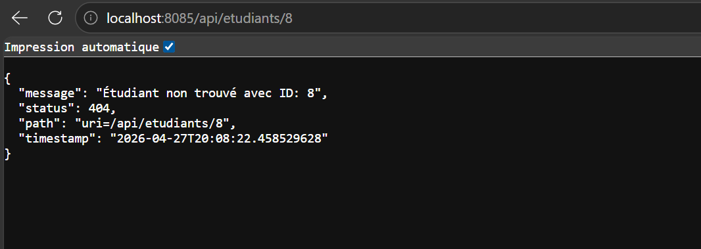

---

## Q14 – Organisation Jira Scrum

### Sprint 1 – API REST de base (Partie 1)

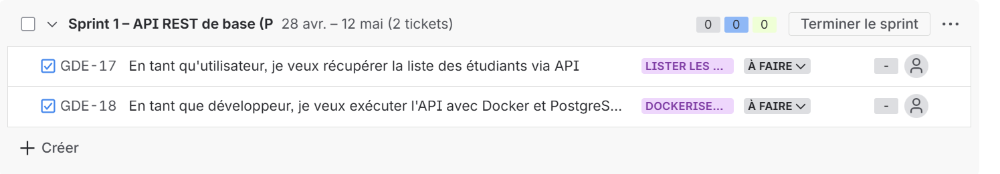

### Sprint 2 – Enrichissement (Partie 2)

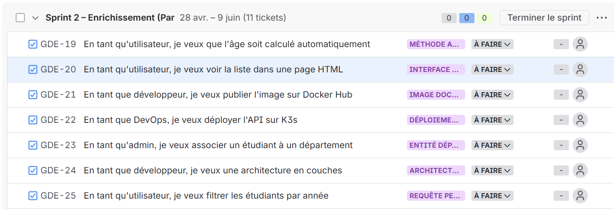


---

## Conclusion

Toutes les fonctionnalités de la Partie 2 ont été implémentées et testées avec succès :

- ✅ API Spring Boot enrichie
- ✅ Tests BDD passants
- ✅ Interface web statique
- ✅ Image Docker publiée
- ✅ Déploiement Kubernetes
- ✅ CRUD complet
- ✅ Gestion des erreurs
- ✅ Organisation Agile avec Jira
