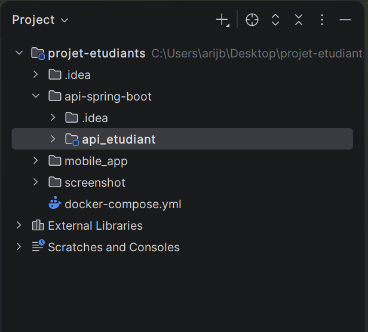
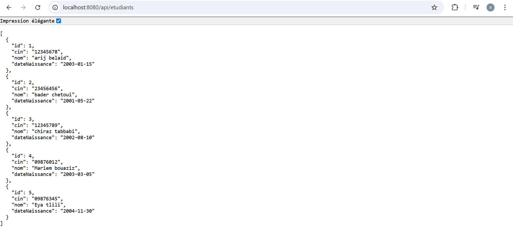
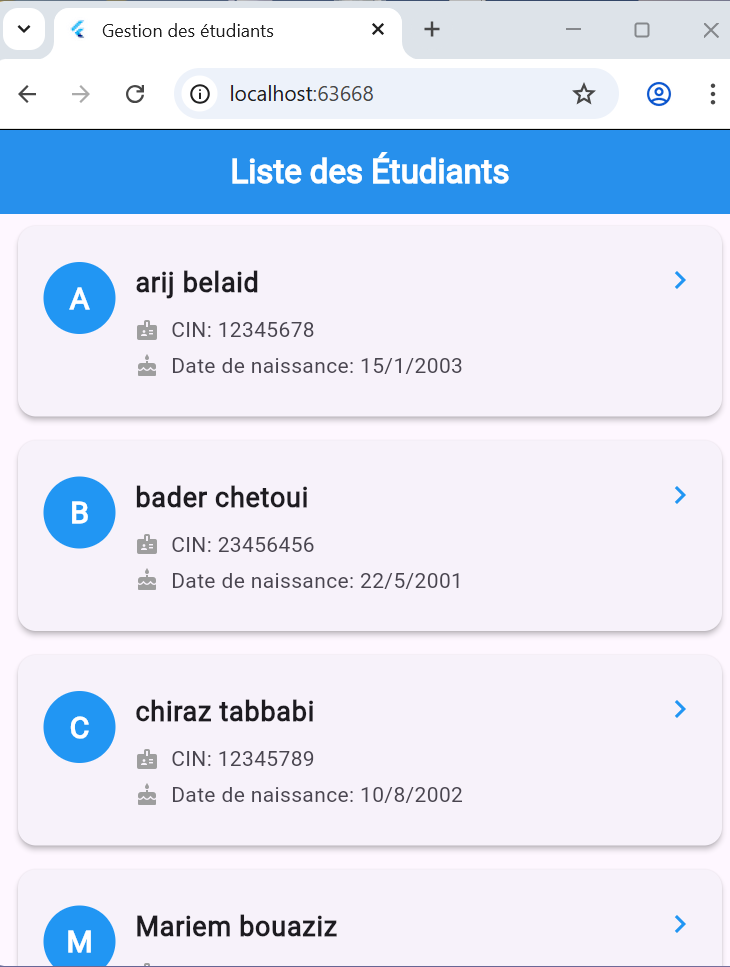

#  Partie 1 – API REST Spring Boot 4 (Gestion des étudiants)

## 📌 Description

Cette API REST développée avec **Spring Boot 4** permet de gérer une liste d'étudiants.
Elle expose un endpoint permettant de récupérer les étudiants depuis une base de données **PostgreSQL** exécutée via Docker.

---

## 🛠️ Technologies utilisées

* Java 17+
* Spring Boot 4
* Spring Web
* Spring Data JPA
* PostgreSQL (via Docker)
* Lombok (optionnel)
* Maven

---

## 🚀 Endpoint disponible

| Méthode | URL              | Description                     |
| ------- | ---------------- | ------------------------------- |
| GET     | `/api/etudiants` | Retourne la liste des étudiants |

---

## 🧾 Attributs d'un étudiant

* `id` : Long (auto-généré)
* `cin` : String
* `nom` : String
* `dateNaissance` : LocalDate

---

## 🐳 Lancer l'API avec Docker (PostgreSQL + Spring Boot)

Assurez-vous que Docker est installé et en cours d'exécution, puis lancez :

```bash id="sqqxrh"
docker compose up --build
```

👉 L'application sera accessible sur :
http://localhost:8080

---

## 📸 Screenshots (Partie 1)

### 1️⃣ Structure du projet

Cette capture montre l'organisation des dossiers du projet Spring Boot :

* `api-spring-boot/` : dossier principal de l'API
* `src/main/java/` : code source Java (controllers, entities, repositories)
* `src/main/resources/` : fichiers de configuration
* `pom.xml` : dépendances Maven



---

### 2️⃣ Liste des étudiants (GET /api/etudiants)

Cette capture présente le résultat de l'appel API `GET /api/etudiants` avec la liste complète des étudiants.

Pour chaque étudiant :

* CIN
* Nom
* Date de naissance



---

### 3️⃣ Exécution de l'API

Cette capture montre le bon fonctionnement de l'application :

* Console de lancement (logs Spring Boot)
* API accessible sur `http://localhost:8080`
* Chargement des données initiales



---

## ✅ Résultat

L'API fonctionne correctement et permet de récupérer les données des étudiants depuis PostgreSQL via un endpoint REST simple.
