#  Partie 1 – API REST Spring Boot 4 (Gestion des étudiants)

## 📌 Description

Cette API REST développée avec **Spring Boot 4** permet de gérer une liste d'étudiants.
Elle expose un endpoint permettant de récupérer les étudiants depuis une base de données **PostgreSQL** exécutée via Docker.

---

## 🛠️ Technologies utilisées

* Java 17+
* Spring Boot 4
* Spring Web
* Spring Data JPA
* PostgreSQL (via Docker)
* Lombok (optionnel)
* Maven

---

## 🚀 Endpoint disponible

| Méthode | URL              | Description                     |
| ------- | ---------------- | ------------------------------- |
| GET     | `/api/etudiants` | Retourne la liste des étudiants |

---

## 🧾 Attributs d'un étudiant

* `id` : Long (auto-généré)
* `cin` : String
* `nom` : String
* `dateNaissance` : LocalDate

---

## 🐳 Lancer l'API avec Docker (PostgreSQL + Spring Boot)

Assurez-vous que Docker est installé et en cours d'exécution, puis lancez :

```bash id="sqqxrh"
docker compose up --build
```

👉 L'application sera accessible sur :
http://localhost:8080

---

## 📸 Screenshots (Partie 1)

### 1️⃣ Structure du projet

Cette capture montre l'organisation des dossiers du projet Spring Boot :

* `api-spring-boot/` : dossier principal de l'API
* `src/main/java/` : code source Java (controllers, entities, repositories)
* `src/main/resources/` : fichiers de configuration
* `pom.xml` : dépendances Maven

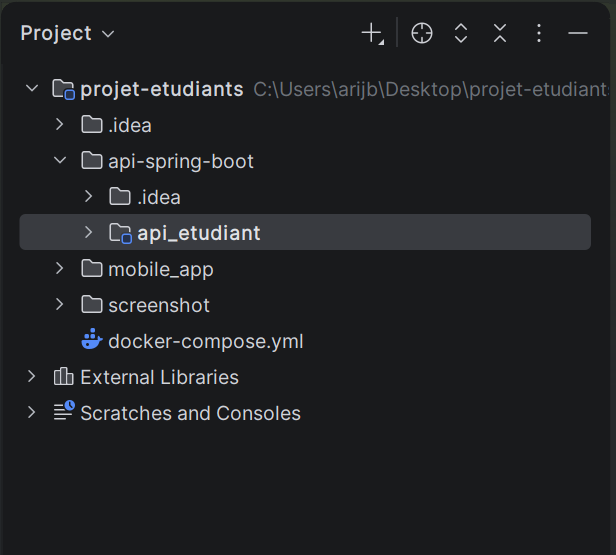

---

### 2️⃣ Liste des étudiants (GET /api/etudiants)

Cette capture présente le résultat de l'appel API `GET /api/etudiants` avec la liste complète des étudiants.

Pour chaque étudiant :

* CIN
* Nom
* Date de naissance

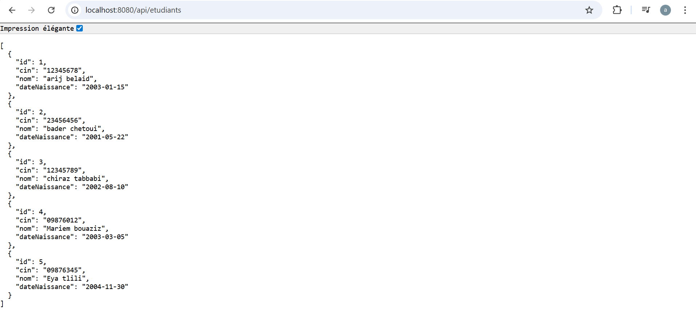

---

### 3️⃣ Exécution de l'API

Cette capture montre le bon fonctionnement de l'application :

* Console de lancement (logs Spring Boot)
* API accessible sur `http://localhost:8080`
* Chargement des données initiales

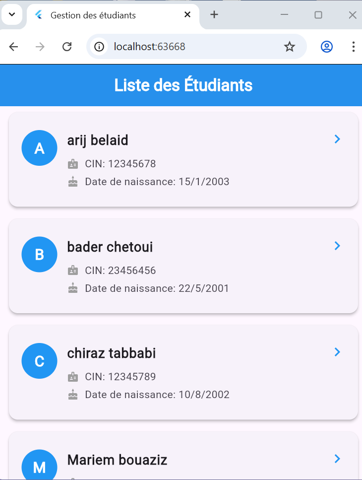

---

## ✅ Résultat

L'API fonctionne correctement et permet de récupérer les données des étudiants depuis PostgreSQL via un endpoint REST simple.

# Partie 2 – Enrichissement de l'API Spring Boot

## Objectif

Cette partie enrichit le projet de la Partie 1 en ajoutant :

- Une méthode de calcul d'âge (`age()`)
- Des tests BDD avec Cucumber
- Une interface web statique (`index.html`)
- Une image Docker publiée sur Docker Hub
- Un déploiement Kubernetes (K3s)
- Une entité `Departement` avec relation `@ManyToOne`
- Une architecture en couches (DTO, Mapper, Service, Controller)
- Des opérations CRUD complètes
- Une gestion des erreurs HTTP standard
- Un cache Redis
- Un projet Jira Scrum

---

## Q3 – Tests BDD avec Cucumber

Exécution des tests Cucumber validant la méthode `age()`.

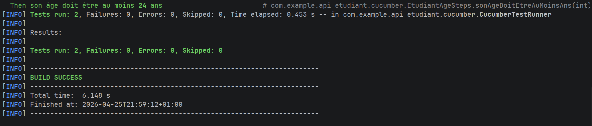

---

## Q4 – Page `index.html` avec Fetch JavaScript

Page statique consommant l'API et affichant les étudiants.

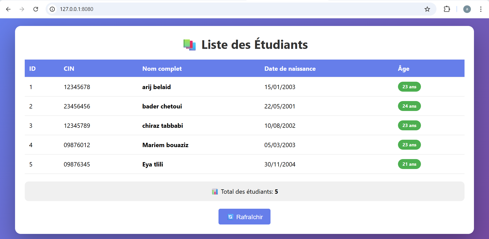

---

## Q6 – Déploiement sur Kubernetes (K3s)

Vérification des pods et services sur le cluster K3s.

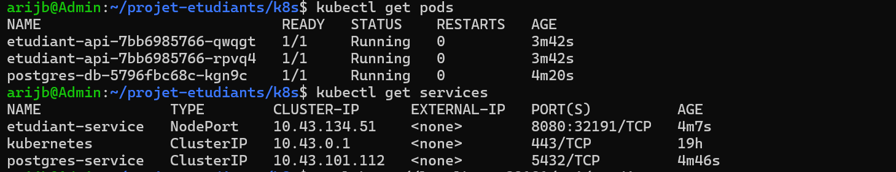

---

## Q7 – Entité Département

Endpoint `GET /api/departements` retournant les 3 départements.

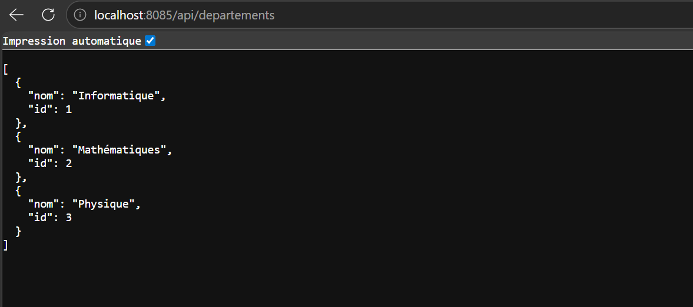

---

## Q9 – Requête personnalisée

Recherche des étudiants par année d'inscription.

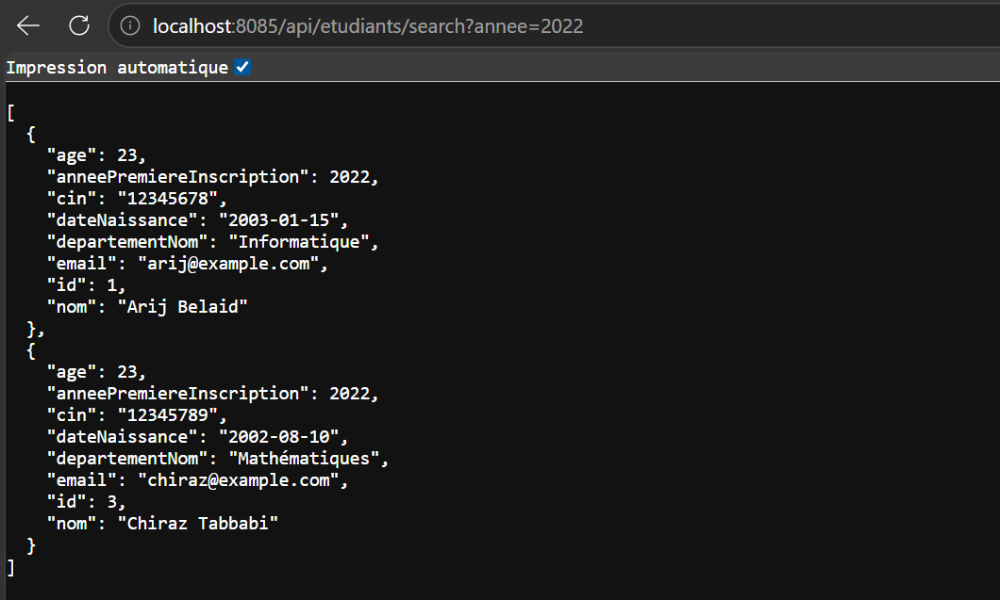

---

## Q10 – CRUD complet

### Création d'un département

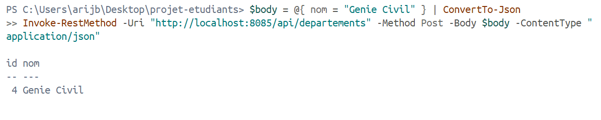

### Création d'un étudiant

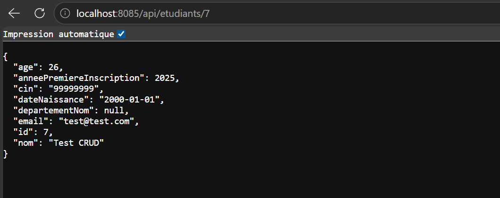

### Modification d'un étudiant

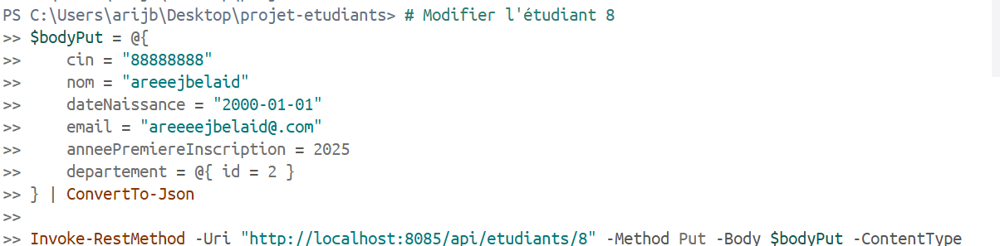

### Suppression d'un étudiant

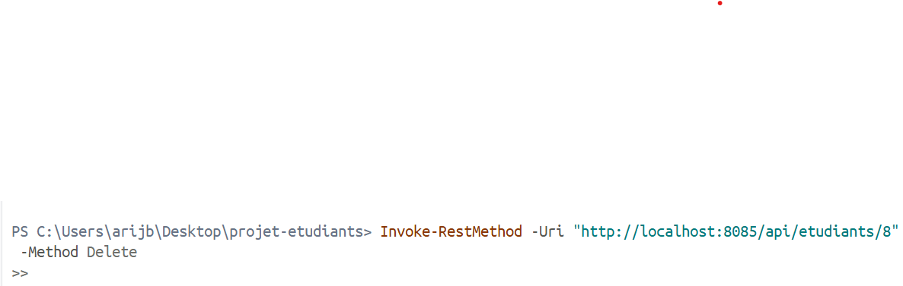

---

## Q11 – Gestion des erreurs

Erreur 404 retournée pour un étudiant inexistant.

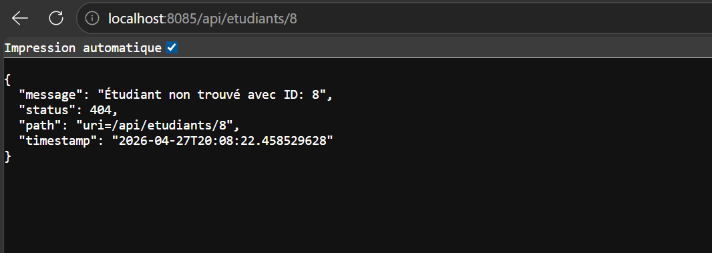

---

## Q14 – Organisation Jira Scrum

### Sprint 1 – API REST de base (Partie 1)

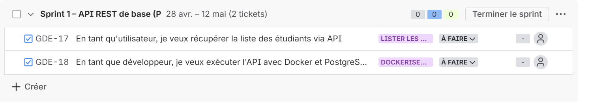

### Sprint 2 – Enrichissement (Partie 2)

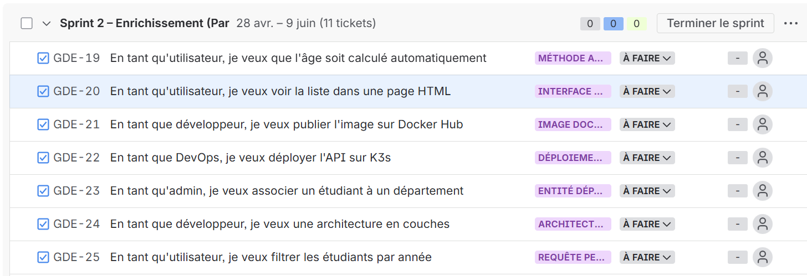


---

## Conclusion

Toutes les fonctionnalités de la Partie 2 ont été implémentées et testées avec succès :

- ✅ API Spring Boot enrichie
- ✅ Tests BDD passants
- ✅ Interface web statique
- ✅ Image Docker publiée
- ✅ Déploiement Kubernetes
- ✅ CRUD complet
- ✅ Gestion des erreurs
- ✅ Organisation Agile avec Jira

# 🚀 Partie 3 – Architecture Microservices

## 📌 Description

Cette partie fait évoluer l’application vers une **architecture microservices complète**.

Le système est désormais composé de plusieurs services indépendants qui communiquent entre eux via :

- 🔍 **Eureka** (Service Discovery)
- 🔗 **OpenFeign** (communication inter-services)

Une **API Gateway** centralise tous les appels clients, tandis qu’un nouveau microservice de gestion des notes est introduit.

L’écosystème est complété par :

- 🌐 Un **frontend Next.js**
- 📱 Une **application mobile Flutter enrichie**

L’ensemble est orchestré avec **Docker Compose** pour un déploiement simple et rapide.

---

## 🛠️ Technologies utilisées

- Java 17+
- Spring Boot
- Spring Cloud (Eureka, OpenFeign, Gateway)
- PostgreSQL
- Redis
- Docker & Docker Compose
- Next.js (React)
- Flutter
- Tailwind CSS
- Swagger / OpenAPI
- Jira (Scrum)

---

## 🧱 Architecture globale

| Service             | Port | Rôle                         |
|--------------------|------|------------------------------|
| eureka-server      | 8761 | Découverte de services       |
| etudiant-service   | 8081 | Gestion des étudiants        |
| grading-service    | 8082 | Gestion des notes            |
| api-gateway        | 8080 | Point d’entrée unique        |
| frontend (Next.js) | 3000 | Interface web                |
| postgres           | 5432 | Base de données              |
| redis              | 6379 | Cache                        |

---

## 🚀 Fonctionnalités principales

### 🔍 Service Discovery (Eureka)

Tous les microservices s’enregistrent automatiquement auprès du serveur Eureka.

---

### 🔗 Communication inter-services (Feign)

Le `grading-service` communique avec `etudiant-service` afin de vérifier l’existence d’un étudiant avant l’ajout d’une note.

---

### 🚪 API Gateway

Tous les clients (web, mobile) passent uniquement par :
http://localhost:8080

---

### 📝 Microservice des notes (grading-service)

- CRUD complet des notes
- Validation des données
- Documentation Swagger intégrée

---

### 🌐 Frontend Next.js

Interface moderne permettant :

- Gestion des étudiants
- Gestion des départements

---

### 📱 Application mobile Flutter

Fonctionnalités ajoutées :

- Récupération des départements
- Sélection via `DropdownButton`
- Filtrage des étudiants par département

---

## 🧾 API – Microservice des notes

| Méthode | Endpoint           | Description            |
|--------|--------------------|------------------------|
| GET    | `/api/notes`       | Liste des notes        |
| GET    | `/api/notes/{id}`  | Détail d’une note      |
| POST   | `/api/notes`       | Ajouter une note       |
| PUT    | `/api/notes/{id}`  | Modifier une note      |
| DELETE | `/api/notes/{id}`  | Supprimer une note     |

---

## 🧩 Modèle de données – Note

- `id` : Long (auto-généré)
- `studentId` : Long
- `matiere` : String
- `valeur` : Double (0–20)

---

## 🔗 Exemple Feign Client

```java
@FeignClient(name = "etudiant-service")
public interface EtudiantClient {

    @GetMapping("/api/etudiants/{id}")
    EtudiantDTO getEtudiantById(@PathVariable Long id);
}

---
## 🚪Configuration API Gateway

---

spring:
  cloud:
    gateway:
      routes:
        - id: etudiant-service
          uri: lb://etudiant-service
          predicates:
            - Path=/api/etudiants/**,/api/departements/**

        - id: grading-service
          uri: lb://grading-service
          predicates:
            - Path=/api/notes/**
---
🌐 Frontend Next.js
📄 Pages disponibles
/etudiants → CRUD des étudiants
/etudiants/[id] → Détail / modification
/departements → Gestion des départements

---
📱 Application mobile (Flutter)

Fonctionnalités :

📥 Récupération des départements
🎯 Filtrage des étudiants
🔽 Interface avec DropdownButton
---

### Partie 4 – Qualité, tests, intégration et authentification (récapitulatif)

🎯 Objectif
Mettre en place une stratégie de test complète (unitaire, intégration, E2E, stress) sur le micro service étudiant, intégrer les résultats de test à Jira via Xray, relier GitHub à Jira, et ajouter un micro service d’authentification (Express + MongoDB + JWT).

✅ Q1 – Branche Git version-4 et Sprint 4 Jira
Création de la branche version-4 à partir de version-3

Création d’un Sprint 4 dans Jira regroupant les user stories associées aux tests, à l’intégration et à l’auth

✅ Q2 – Stratégie de test complète sur etudiant-service (couverture ≥ 80 %)
Type de test	Outils	Niveau visé
Unitaire	JUnit 5 + Mockito	Méthodes Service (logique métier)
Intégration	Testcontainers (PostgreSQL)	Persistance JPA
E2E	Cypress (sur frontend Next.js)	Parcours utilisateur complet
Stress	Gatling	Performance de l’API sous charge
Couverture	JaCoCo (seuil 80 % lignes)	Build Maven échoue si couverture < 80 %
Les tests d’intégration utilisent Testcontainers (PostgreSQL réel dans un conteneur Docker)

Les tests de stress simulent 50 utilisateurs concurrents sur 30 secondes

JaCoCo bloque le build si la couverture ligne est inférieure à 80 %

✅ Q3 – Testcontainers pour PostgreSQL (intégré à Q2)
Dépendances testcontainers-junit-jupiter et postgresql ajoutées

Configuration via @Testcontainers + @DynamicPropertySource

✅ Q4 – Intégration GitHub ↔ Jira
Installation de l’application GitHub for Jira dans Jira Cloud

Conventions à respecter :

Branches : feature/GDE-XX-description

Commits : GDE-XX : message

PR : titre contenant la clé du ticket

Jira lie automatiquement les commits, branches et PRs au ticket correspondant

✅ Q5 – Intégration Xray pour la gestion des cas de test
Installation du plugin Xray dans Jira

Création d’un Test dans Jira pour chaque méthode de test importante

Regroupement des tests du Sprint 4 dans un Test Plan

Publication automatique des résultats JUnit via GitHub Actions (test-and-report.yml) vers l’API REST de Xray

✅ Q6 – Micro service d’authentification (Express + MongoDB + JWT)
Service auth-service avec Node.js / Express

Base de données MongoDB (conteneur dédié)

Endpoints :

POST /auth/register – inscription (hachage bcrypt)

POST /auth/login – retourne un token JWT

Intégration dans docker-compose.yml (ports, dépendances, variables d’environnement)

✅ Mise à jour de docker-compose.yml
Ajout des services :

Service	Port exposé	Dépend de
mongodb	27017	–
auth-service	3001	mongodb
Réseau commun app-network utilisé par tous les services

Volumes persistants pour PostgreSQL (postgres_data) et MongoDB (mongodb_data)

📦 Structure du dépôt (Partie 4)
text
projet-etudiants/
├── api-spring-boot/           # Micro service étudiant (tests inclus)
│   └── src/test/java/...      # Tests unitaires + intégration
│   └── src/gatling/...        # Simulations Gatling
├── auth-service/              # Micro service d’authentification
│   ├── app.js
│   ├── models/User.js
│   ├── routes/auth.js
│   ├── .env
│   └── Dockerfile
├── frontend/
│   └── cypress/e2e/           # Tests E2E Cypress
├── .github/
│   ├── workflows/
│   │   └── test-and-report.yml   # CI avec publication Xray
│   ├── ISSUE_TEMPLATE/
│   │   └── bug_report.md
│   └── pull_request_template.md
└── docker-compose.yml          # Service mongodb + auth-service ajoutés
🚀 Lancement et validation
bash
# Lancer toute l’architecture
docker compose up --build -d

# Exécuter les tests (unitaires + intégration + stress)
cd api-spring-boot/api_etudiant
mvn clean verify

# Exécuter les tests E2E (frontend)
cd ../../
cd frontend
npx cypress run

# Tester l’authentification
curl -X POST http://localhost:3001/auth/register -H "Content-Type: application/json" -d '{"username":"test","password":"123"}'
curl -X POST http://localhost:3001/auth/login -H "Content-Type: application/json" -d '{"username":"test","password":"123"}'
✅ Conclusion
La couverture de code atteint ≥ 80 % (JaCoCo)

Les tests sont automatisés et intégrés à la CI

GitHub et Jira sont synchronisés (branches, commits, PRs)

Les résultats de tests sont remontés dans Jira via Xray

Un service d’authentification complet (JWT) est opérationnel

